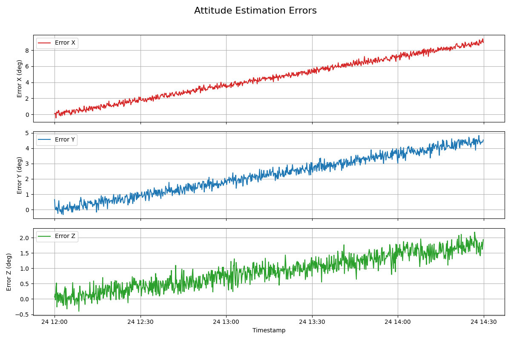
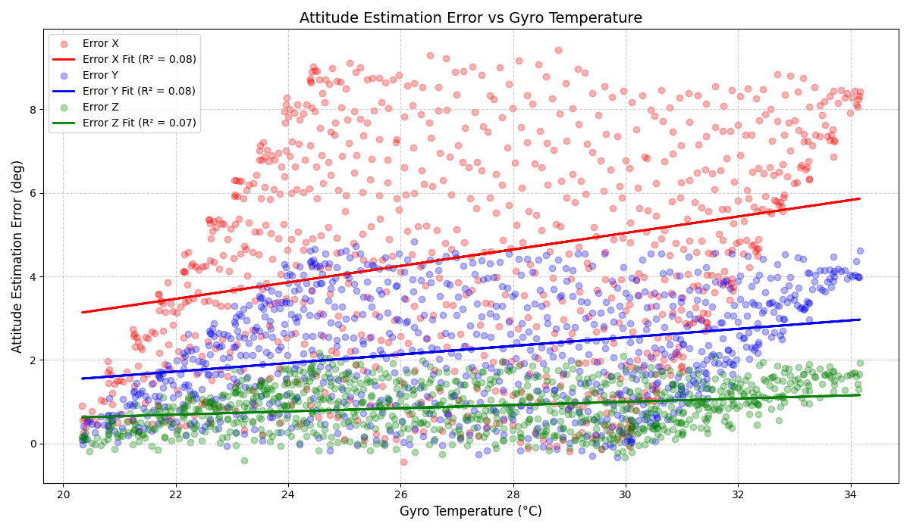
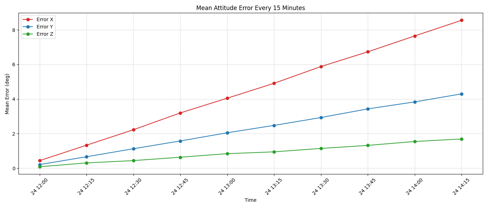

# Gyroscope Thermal Drift Case

**Author:** Tomas Amantea  
**Date:** 2025-06-24  
**System:** AOCS  
**Document Type:** Performance Review  

---

## Summary:

In recent days, operators have observed small but systematic pointing offsets accumulating over time. While the satellite has not experienced any critical failures, it is necessary to analyze this behavior to prevent potential issues in the future. The main hypothesis is that these deviations may be correlated with thermal variations affecting the gyroscope.

---

## Data Analysis Summary
Since we are analyzing the impact of thermal drift on a gyroscope, and there is no extremely sensitive payload (such as a telescope), we could use a reasonable operating threshold of:

* ±0.5° as a warning limit.
* 1.0° as a signal of a potential operational problem.
---

## Observed Metrics
The attitude estimation error shows a clear and consistent increase over time, especially in the X-axis, where the error exceeds 8° by the end of the analyzed window. Similar trends, though less severe, are observed in the Y and Z axes.

These values are far beyond the typical operational tolerance of ±0.5° to ±1°, indicating that the estimation system is undergoing a progressive drift. The results confirm that this behavior requires investigation, as it could impact the performance of subsystems relying on accurate pointing.
There are several sources that can be associated with this behavior. For example:

|Source| Impact|
|------|--------|
|Temperature|Sensitive sensors such as MEMS gyroscopes change their response with temperature|
|Gyroscope bias (bias drift)|A constant bias that accumulates over time if not corrected.|
|Sensor degradation|Over time, due to radiation or aging.|
|External disturbances|Magnetic fields or accelerations that alter measurements|

In this scenario the pattern indicates:
A gradual, smooth, and cumulative increase in error.There are no jumps or extreme noise.
The increase is monotonic, at least in X and Y.

This suggests no sudden failure or random noise. It's most likely uncorrected accumulated thermal bias, which is very characteristic of a gyroscope problem.

---

## Recommendations

Correlate the error with the gyro temperature.

See if there is a direct relationship (for example, as the temperature increases, the error increases).

If so, this would confirm that the estimation model is not correctly compensating for the thermal bias.

---
## Results

To evaluate the potential dependence of attitude estimation error on gyroscope temperature, a scatter plot was generated comparing these variables across all three axes. A linear regression line was fitted to each dataset to highlight any potential correlation trends more precisely.

The results show no significant linear relationship between temperature and estimation error. The regression slopes for all axes remain below 0.02 deg/°C, and the low R² values indicate minimal explanatory power. Although slight non-linear behavior is observed at low temperature ranges, it does not suggest a consistent or systematic thermal bias affecting the attitude determination process.
Next step willl be evaluate a potencial systematic bias.

The attitude estimation errors for all three axes (X, Y, Z) show a consistent and approximately linear increase over the course of the day. While the growth rates vary slightly between axes, their overall behavior suggests a progressive accumulation of error.

Based on the current evidence, the most likely explanation is:

A bias in the gyroscope measurement, uncorrected or under-compensated, causes the AOCS system to accumulate a small but systematic error during integration of angular rates. This results in a gradual drift in the estimated attitude over time.

Other contributing factors, such as an incomplete sensor calibration or an inaccurate attitude propagation model, cannot yet be ruled out. However, the smooth and monotonic nature of the error supports a bias-driven drift as the primary mechanism.

Although not critical at this stage, the issue may become significant for high-precision pointing tasks or longer mission durations. It is recommended to further characterize the gyroscope bias and validate the AOCS integration algorithm.

---
## Attached Files

- `attitude_error.png`
- `Gyro_thermal_drift_case.csv`
- `error_vs_gyro_temp.png`
- `quarter_hour_error_mean.png`

---

