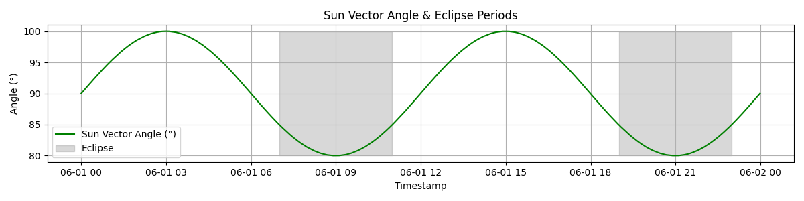
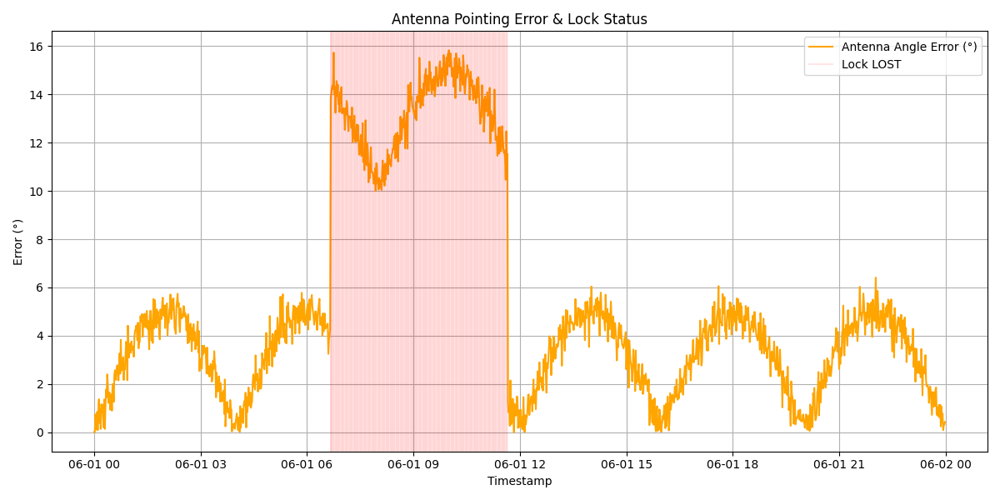
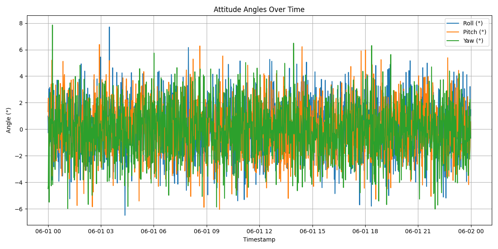

# Antenna Pointing Loss Correlated with Eclipse Onset

**Author:** Tomas Amantea  
**Date:** 2025-06-24  
**System:** Communications/AOCS  
**Document Type:** Performance Review  

---

## Summary:

In recent days, the satellite has suffered repeated signal losses, even though the attitude reported by the AOCS appears to be within expected limits. Ground stations are unable to maintain lock during passes.
The objetive is analayze the source of that error.

---

## Data Analysis Summary

-  **Affected period**: ~06:40 – 11:40 UTC
-  **Lock loss**: coincides with antenna error >7°
-  **Attitude**: nominal, no abnormal drift or oscillations
- **Eclipse**: overlaps precisely with the failure onset, but not with later faults

---

## Observed Metrics

During the first eclipse of the day, a sustained loss of lock with the ground station occurred due to an antenna pointing error exceeding 7°, peaking near 15°.

The satellite attitude (roll, pitch, yaw) remained nominal, ruling out a control issue.

We hypothesize that:

>  A misconfiguration or incorrect transition in pointing strategy during eclipse led to a persistent offset in antenna alignment, resulting in signal loss.  
> The system later returned to normal behavior, as no further issues occurred during subsequent eclipse events.

---

## Recommendations

- Inspect **active pointing table** during eclipse entry
- Review **mode transition logs** during the affected window
- Verify how **pointing logic** adapts under eclipse conditions
- Continue **monitoring future passes** for consistency

---

## Attached Files

- `attitude_angles.png`
- `antenna_error_lock.png`
- `sun_vector_eclipse.png`
- `aocs_logs.csv`

---

